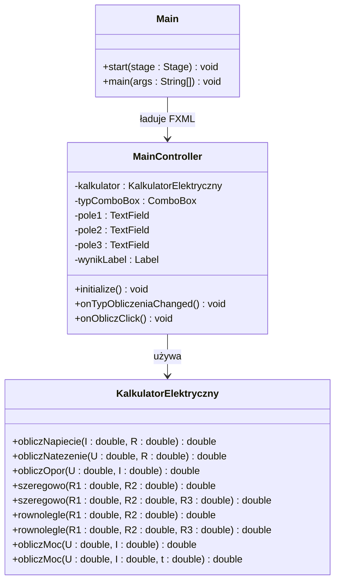

# Zadanie laboratoryjne  


[](https://docs.oracle.com/en/java/)
[](https://openjfx.io/javadoc/21/)

**Przedmiot:** *Programowanie obiektowe*  

##  Dane studenta

| Pole | Wartość                                       |
|---|-----------------------------------------------|
| Imię i nazwisko | Szymon Zeller                                 |
| Numer albumu | 10149                                         |
| Kierunek / specjalność | Informatyka |
| Rok/Semestr | I/II                                          |
| Grupa laboratoryjna | grupa 1                                       |
| Rok akademicki | 2025/2026                                     |
| Prowadzący | mgr inż. Artur Pelo                           |

##  Informacje o zadaniu

| Pole | Wartość |
|---|---|
| Numer laboratorium | 5 |
| Temat laboratorium | Obiekty w modelu GUI. Działania na operatorach, przeciążanie operatorów, tworzenie operatorów, przeciążanie (przeładowanie) metod. |
| Data realizacji | 09.06.2026 |
| Data oddania | 16.06.2026 |
| Język programowania | Java (JavaFX + FXML) |
| Środowisko / IDE | IntelliJ IDEA |

##  Treść zadania

Krótki opis zadania:

Stwórz aplikację okienkową **Kalkulator Elektryczny** w JavaFX z layoutem FXML. Aplikacja umożliwia obliczanie wielkości elektrycznych na podstawie prawa Ohma, łączenia rezystorów oraz mocy i energii. Logika obliczeniowa musi być zaimplementowana w klasie `KalkulatorElektryczny` z **przeciążonymi metodami** — ta sama nazwa metody działa inaczej zależnie od liczby podanych parametrów. Użytkownik wybiera typ obliczenia z listy rozwijanej, a aplikacja dynamicznie pokazuje odpowiednie pola.

##  Wymagania funkcjonalne

| ID | Opis wymagania | Poziom |
|---|---|---|
| WF-01 | Użytkownik wybiera typ obliczenia z `ComboBox` (prawo Ohma, rezystory szeregowo, równolegle, moc/energia). | Wysoki |
| WF-02 | Po wyborze typu obliczenia widoczne są tylko odpowiednie pola `TextField` z podpisami jednostek (Ω, V, A, s). | Wysoki |
| WF-03 | Klasa `KalkulatorElektryczny` zawiera przeciążoną metodę `szeregowo` dla 2 i 3 rezystorów. | Wysoki |
| WF-04 | Klasa `KalkulatorElektryczny` zawiera przeciążoną metodę `rownolegle` dla 2 i 3 rezystorów. | Wysoki |
| WF-05 | Klasa `KalkulatorElektryczny` zawiera przeciążoną metodę `obliczMoc`: wersja 2-parametrowa (moc P) i 3-parametrowa (energia W). | Wysoki |
| WF-06 | Wynik wyświetlany jest w `Label` wraz z jednostką (Ω, V, A, W, J) po kliknięciu „Oblicz". | Wysoki |
| WF-07 | Program wyświetla komunikat błędu przy nieprawidłowych danych wejściowych (tekst, dzielenie przez zero). | Średni |

##  Wymagania niefunkcjonalne

| ID | Opis wymagania | Poziom |
|---|---|---|
| WN-01 | Layout aplikacji zdefiniowany jest w pliku `main.fxml`. | Wysoki |
| WN-02 | Logika obliczeniowa oddzielona od kontrolera — wyłącznie w klasie `KalkulatorElektryczny.java`. | Wysoki |
| WN-03 | Kontroler `MainController.java` obsługuje zdarzenia GUI i wywołuje metody klasy `KalkulatorElektryczny`. | Wysoki |
| WN-04 | Kod kompiluje się i uruchamia bez błędów w środowisku IntelliJ IDEA z JavaFX SDK. | Wysoki |

##  Realizacja zadania

Opis implementacji:

Klasa `KalkulatorElektryczny` zawiera osiem metod podzielonych na grupy, z których trzy pary stanowią **przeciążenia** (ta sama nazwa, różna liczba parametrów). Plik `main.fxml` definiuje układ okna z `ComboBox`, polami `TextField`, przyciskiem i etykietą wyniku. Kontroler reaguje na zmianę wyboru w `ComboBox` (metoda `onTypObliczeniaChanged`), pokazując/ukrywając pola, a po kliknięciu „Oblicz" wywołuje odpowiednią wersję metody z `KalkulatorElektryczny`.

Sygnatury metod w klasie `KalkulatorElektryczny`:

```java
// Prawo Ohma (trzy oddzielne metody — obliczają różne wielkości)
double obliczNapiecie(double I, double R)      // U = I · R
double obliczNatezenie(double U, double R)     // I = U / R
double obliczOpor(double U, double I)          // R = U / I

// Rezystory szeregowo — PRZECIĄŻANIE METOD
double szeregowo(double R1, double R2)               // R = R1 + R2
double szeregowo(double R1, double R2, double R3)    // R = R1 + R2 + R3

// Rezystory równolegle — PRZECIĄŻANIE METOD
double rownolegle(double R1, double R2)              // 1/(1/R1 + 1/R2)
double rownolegle(double R1, double R2, double R3)   // 1/(1/R1 + 1/R2 + 1/R3)

// Moc i energia — PRZECIĄŻANIE METOD
double obliczMoc(double U, double I)                 // P = U · I  [W]
double obliczMoc(double U, double I, double t)       // W = U · I · t  [J]
```

##  Diagram klas



##  Kod źródłowy

###  Java + FXML

```java
// KalkulatorElektryczny.java

```

```java
// MainController.java

```

```java
// Main.java

```

```xml
<!-- main.fxml -->

```

##  Wynik działania programu

Opis testów i przykładowe wyniki:

................................................................................

................................................................................

```
Wklej tutaj zrzut ekranu lub opis działania aplikacji dla każdego typu obliczenia.
Przykład:

  Typ: Napięcie (Prawo Ohma)  I = 2 A,  R = 47 Ω
  Wynik: U = 94.00 V

  Typ: Rezystory szeregowo (3)  R1 = 100 Ω,  R2 = 220 Ω,  R3 = 330 Ω
  Wynik: R = 650.00 Ω

  Typ: Rezystory równolegle (2)  R1 = 100 Ω,  R2 = 100 Ω
  Wynik: R = 50.00 Ω

  Typ: Energia  U = 230 V,  I = 5 A,  t = 3600 s
  Wynik: W = 4 140 000.00 J
```

##  Samoocena studenta

| Kryterium | Tak / Nie | Uwagi |
|---|---|---|
| Program uruchamia się bez błędów |  |  |
| Layout zdefiniowany w pliku FXML |  |  |
| Zaimplementowano przeciążenie metody `szeregowo` (2 i 3 rezystory) |  |  |
| Zaimplementowano przeciążenie metody `rownolegle` (2 i 3 rezystory) |  |  |
| Zaimplementowano przeciążenie metody `obliczMoc` (moc P i energia W) |  |  |
| Kontroler poprawnie pokazuje/ukrywa pola po zmianie wyboru |  |  |
| Program reaguje na błędne dane wejściowe |  |  |
| Logika obliczeniowa oddzielona od kontrolera |  |  |

## Przesłanie pliku do oceny:
[](https://upload2.pelo.com.pl) [zawartość: uzupełniony TEN plik oraz podfolder LAB5 z plikami źródłowymi]

##  Ocena prowadzącego

| Element oceny | Punkty maks. | Punkty uzyskane |
|---|---:|---:|
| Poprawność działania | 6 |  |
| Zastosowanie OOP | 6 |  |
| Jakość kodu | 6 |  |
| Terminowość oddania | 2 |  |
| **Suma** | **20** |  |

Skala oceniania:

| Zakres % | Punkty | Ocena |
|---|---|---|
| 0–50% | 0–10 | 2.0 |
| 51–60% | 11–12 | 3.0 |
| 61–70% | 13–14 | 3.5 |
| 71–80% | 15–16 | 4.0 |
| 81–90% | 17–18 | 4.5 |
| 91–100% | 19–20 | 5.0 |

### OCENA:...

Uwagi prowadzącego:

................................................................................

................................................................................
