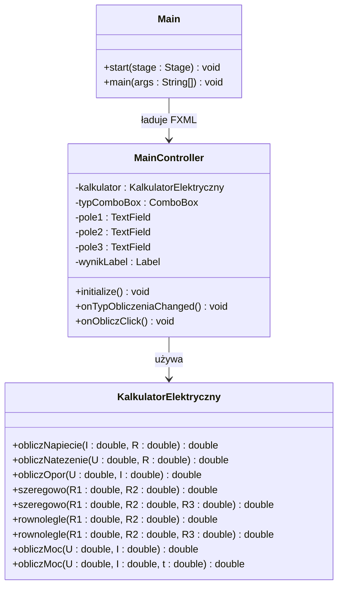

# Zadanie laboratoryjne  


[](https://docs.oracle.com/en/java/)
[](https://openjfx.io/javadoc/21/)

**Przedmiot:** *Programowanie obiektowe*  

##  Dane studenta

| Pole | Wartość                                       |
|---|-----------------------------------------------|
| Imię i nazwisko | Szymon Zeller                                 |
| Numer albumu | 10149                                         |
| Kierunek / specjalność | Informatyka |
| Rok/Semestr | I/II                                          |
| Grupa laboratoryjna | grupa 1                                       |
| Rok akademicki | 2025/2026                                     |
| Prowadzący | mgr inż. Artur Pelo                           |

##  Informacje o zadaniu

| Pole | Wartość |
|---|---|
| Numer laboratorium | 5 |
| Temat laboratorium | Obiekty w modelu GUI. Działania na operatorach, przeciążanie operatorów, tworzenie operatorów, przeciążanie (przeładowanie) metod. |
| Data realizacji | 09.06.2026 |
| Data oddania | 16.06.2026 |
| Język programowania | Java (JavaFX + FXML) |
| Środowisko / IDE | IntelliJ IDEA |

##  Treść zadania

Krótki opis zadania:

Stwórz aplikację okienkową **Kalkulator Elektryczny** w JavaFX z layoutem FXML. Aplikacja umożliwia obliczanie wielkości elektrycznych na podstawie prawa Ohma, łączenia rezystorów oraz mocy i energii. Logika obliczeniowa musi być zaimplementowana w klasie `KalkulatorElektryczny` z **przeciążonymi metodami** — ta sama nazwa metody działa inaczej zależnie od liczby podanych parametrów. Użytkownik wybiera typ obliczenia z listy rozwijanej, a aplikacja dynamicznie pokazuje odpowiednie pola.

##  Wymagania funkcjonalne

| ID | Opis wymagania | Poziom |
|---|---|---|
| WF-01 | Użytkownik wybiera typ obliczenia z `ComboBox` (prawo Ohma, rezystory szeregowo, równolegle, moc/energia). | Wysoki |
| WF-02 | Po wyborze typu obliczenia widoczne są tylko odpowiednie pola `TextField` z podpisami jednostek (Ω, V, A, s). | Wysoki |
| WF-03 | Klasa `KalkulatorElektryczny` zawiera przeciążoną metodę `szeregowo` dla 2 i 3 rezystorów. | Wysoki |
| WF-04 | Klasa `KalkulatorElektryczny` zawiera przeciążoną metodę `rownolegle` dla 2 i 3 rezystorów. | Wysoki |
| WF-05 | Klasa `KalkulatorElektryczny` zawiera przeciążoną metodę `obliczMoc`: wersja 2-parametrowa (moc P) i 3-parametrowa (energia W). | Wysoki |
| WF-06 | Wynik wyświetlany jest w `Label` wraz z jednostką (Ω, V, A, W, J) po kliknięciu „Oblicz". | Wysoki |
| WF-07 | Program wyświetla komunikat błędu przy nieprawidłowych danych wejściowych (tekst, dzielenie przez zero). | Średni |

##  Wymagania niefunkcjonalne

| ID | Opis wymagania | Poziom |
|---|---|---|
| WN-01 | Layout aplikacji zdefiniowany jest w pliku `main.fxml`. | Wysoki |
| WN-02 | Logika obliczeniowa oddzielona od kontrolera — wyłącznie w klasie `KalkulatorElektryczny.java`. | Wysoki |
| WN-03 | Kontroler `MainController.java` obsługuje zdarzenia GUI i wywołuje metody klasy `KalkulatorElektryczny`. | Wysoki |
| WN-04 | Kod kompiluje się i uruchamia bez błędów w środowisku IntelliJ IDEA z JavaFX SDK. | Wysoki |

##  Realizacja zadania

Opis implementacji:

Klasa `KalkulatorElektryczny` zawiera osiem metod podzielonych na grupy, z których trzy pary stanowią **przeciążenia** (ta sama nazwa, różna liczba parametrów). Plik `main.fxml` definiuje układ okna z `ComboBox`, polami `TextField`, przyciskiem i etykietą wyniku. Kontroler reaguje na zmianę wyboru w `ComboBox` (metoda `onTypObliczeniaChanged`), pokazując/ukrywając pola, a po kliknięciu „Oblicz" wywołuje odpowiednią wersję metody z `KalkulatorElektryczny`.

Sygnatury metod w klasie `KalkulatorElektryczny`:

```java
// Prawo Ohma (trzy oddzielne metody — obliczają różne wielkości)
double obliczNapiecie(double I, double R);      // U = I · R
double obliczNatezenie(double U, double R);    // I = U / R
double obliczOpor(double U, double I);      // R = U / I

// Rezystory szeregowo — PRZECIĄŻANIE METOD
double szeregowo(double R1, double R2);               // R = R1 + R2
double szeregowo(double R1, double R2, double R3);    // R = R1 + R2 + R3

// Rezystory równolegle — PRZECIĄŻANIE METOD
double rownolegle(double R1, double R2);              // 1/(1/R1 + 1/R2)
double rownolegle(double R1, double R2, double R3);   // 1/(1/R1 + 1/R2 + 1/R3)

// Moc i energia — PRZECIĄŻANIE METOD
double obliczMoc(double U, double I);                 // P = U · I  [W]
double obliczMoc(double U, double I, double t);       // W = U · I · t  [J]
```

##  Diagram klas



##  Kod źródłowy

###  Java + FXML

```java
// KalkulatorElektryczny.java
package org.example.kalkulator_elektryczny;

public class KalkulatorElektryczny {

    public double obliczNapiecie(double I, double R){
        return I*R;
    }
    public double obliczNatezenie(double U, double R){
        return U/R;
    }
    public double obliczOpor(double U, double I){
        return U/I;
    }

    public double szeregowo(double R1, double R2){
        return R1+R2;
    }
    public double szeregowo(double R1, double R2, double R3){
        return R1+R2+R3;
    }

    public double rownolegle(double R1, double R2){
        return 1/(1/R1 + 1/R2);
    }
    public double rownolegle(double R1, double R2, double R3){
        return 1/(1/R1 + 1/R2 + 1/R3);
    }

    double obliczMoc(double U, double I){
        return U*I;
    }
    double obliczMoc(double U, double I, double t){
        return U*I*t;
    }
}

```

```java
// MainController.java
package org.example.kalkulator_elektryczny;

import javafx.fxml.FXML;
import javafx.scene.control.ComboBox;
import javafx.scene.control.Label;
import javafx.scene.control.TextField;

public class MainController {

    @FXML
    private KalkulatorElektryczny kalkulatorElektryczny = new KalkulatorElektryczny();
    @FXML
    private ComboBox typComboBox;
    @FXML
    private Label pole1label;
    @FXML
    private TextField pole1;
    @FXML
    private Label pole2label;
    @FXML
    private TextField pole2;
    @FXML
    private Label pole3label;
    @FXML
    private TextField pole3;
    @FXML
    private Label wynikLabel;

    @FXML
    public void initialize(){
        pole1.setDisable(true);
        pole2.setDisable(true);
        pole3.setDisable(true);
    }

    @FXML
    public void onTypObliczeniaChanged(){
        pole1.setDisable(false);
        pole2.setDisable(false);
        pole3.setDisable(false);
        pole1.setText("");
        pole2.setText("");
        pole3.setText("");
        wynikLabel.setText("");
        switch (typComboBox.getValue().toString()){
            case "Napiecie":
                pole1label.setText("Natezenie");
                pole2label.setText("Opor");
                pole3.setDisable(true);
                break;
            case "Natezenie":
                pole1label.setText("Napiecie");
                pole2label.setText("Opor");
                pole3.setDisable(true);
                break;
            case "Opor":
                pole1label.setText("Napiecie");
                pole2label.setText("Natezenie");
                pole3.setDisable(true);
                break;
            case "Opor Szeregowy":
            case "Opor Rownolegly":
                pole1label.setText("R1");
                pole2label.setText("R2");
                pole3label.setText("R3");
                pole3.setDisable(false);
                break;
            case "Moc":
                pole1label.setText("Napiecie");
                pole2label.setText("Natezenie");
                pole3label.setText("Czas (sekundy)");
                pole3.setDisable(false);
                break;
        }
    }

    public static boolean checkIfNumber(String s){
        try{
            Double.parseDouble(s);
            return true;
        }catch(NumberFormatException e){
            return false;
        }
    }

    @FXML
    public void onObliczClick(){
        if(pole1.getText().isEmpty() || pole2.getText().isEmpty()){
            wynikLabel.setText("Jedna z dwoch wymaganych wartosci jest pusta");
        }else{
            if (checkIfNumber(pole1.getText()) ||  checkIfNumber(pole2.getText()) || checkIfNumber(pole3.getText())){
                Double pole1num = Double.parseDouble(pole1.getText());
                Double pole2num = Double.parseDouble(pole2.getText());
                Double pole3num = 0.0;
                if(!pole3.getText().isEmpty()){
                    pole3num = Double.parseDouble(pole3.getText());
                }
                switch (typComboBox.getValue().toString()){
                    case "Napiecie":
                        wynikLabel.setText(kalkulatorElektryczny.obliczNapiecie(pole1num, pole2num) + "V");
                        break;
                    case "Natezenie":
                        wynikLabel.setText(kalkulatorElektryczny.obliczNatezenie(pole1num, pole2num) + "A");
                        break;
                    case "Opor":
                        wynikLabel.setText(kalkulatorElektryczny.obliczOpor(pole1num, pole2num) + "Ω");
                        break;
                    case "Opor Szeregowy":
                        if(pole3.getText().isEmpty()){
                            wynikLabel.setText(kalkulatorElektryczny.szeregowo(pole1num, pole2num) + "Ω");
                        }else{
                            wynikLabel.setText(kalkulatorElektryczny.szeregowo(pole1num, pole2num, pole3num) + "Ω");
                        }
                        break;
                    case "Opor Rownolegly":
                        if(pole3.getText().isEmpty()){
                            wynikLabel.setText(kalkulatorElektryczny.rownolegle(pole1num, pole2num) + "Ω");
                        }else{
                            wynikLabel.setText(kalkulatorElektryczny.rownolegle(pole1num, pole2num, pole3num) + "Ω");
                        }
                        break;
                    case "Moc":
                        if(pole3.getText().isEmpty()){
                            wynikLabel.setText(kalkulatorElektryczny.obliczMoc(pole1num, pole2num) + "W");
                        }else{
                            wynikLabel.setText(kalkulatorElektryczny.obliczMoc(pole1num, pole2num, pole3num) + "J");
                        }
                        break;
                }
            }else{
                wynikLabel.setText("Zla wartosc wejsciowa na jednym z pol");
            }
        }
    }
}

```

```java
// Main.java
package org.example.kalkulator_elektryczny;

import javafx.application.Application;
import javafx.fxml.FXMLLoader;
import javafx.scene.Scene;
import javafx.stage.Stage;

import java.io.IOException;

public class Main extends Application {
    @Override
    public void start(Stage stage) throws IOException {
        FXMLLoader fxmlLoader = new FXMLLoader(Main.class.getResource("main.fxml"));
        Scene scene = new Scene(fxmlLoader.load(), 500, 500);
        stage.setTitle("Kalkulator Elektryczny");
        stage.setScene(scene);
        stage.show();
    }
}

```

```xml
<!-- main.fxml -->
<?xml version="1.0" encoding="UTF-8"?>

<?import java.lang.*?>
<?import javafx.collections.*?>
<?import javafx.geometry.*?>
<?import javafx.scene.control.*?>
<?import javafx.scene.layout.*?>
<?import javafx.scene.text.*?>

<VBox alignment="CENTER" prefHeight="499.0" prefWidth="500.0" spacing="20.0" xmlns="http://javafx.com/javafx/17.0.12" xmlns:fx="http://javafx.com/fxml/1" fx:controller="org.example.kalkulator_elektryczny.MainController">
    <padding>
        <Insets bottom="20.0" left="20.0" right="20.0" top="20.0" />
    </padding>
    <Label alignment="CENTER" prefHeight="38.0" prefWidth="392.0" text="Kalkulator Elektryczny">
        <font>
            <Font size="24.0" />
        </font>
    </Label>
    <ComboBox fx:id="typComboBox" onAction="#onTypObliczeniaChanged" promptText="Wybierz Dzialanie">
        <items>
            <FXCollections fx:factory="observableArrayList">
                <String fx:value="Napiecie" />
                <String fx:value="Natezenie" />
                <String fx:value="Opor" />
                <String fx:value="Opor Szeregowy" />
                <String fx:value="Opor Rownolegly" />
                <String fx:value="Moc" />
            </FXCollections>
        </items>
    </ComboBox>
    <Label fx:id="pole1label" alignment="CENTER" prefHeight="17.0" prefWidth="101.0" text="OP1" />
    <TextField fx:id="pole1" prefHeight="25.0" prefWidth="459.0" />
    <Label fx:id="pole2label" alignment="CENTER" prefHeight="17.0" prefWidth="95.0" text="OP2" />
    <TextField fx:id="pole2" />
    <Label fx:id="pole3label" alignment="CENTER" prefHeight="17.0" prefWidth="89.0" text="OP3" />
    <TextField fx:id="pole3" />
    <Button onAction="#onObliczClick" prefHeight="40.0" prefWidth="122.0" text="Oblicz">
        <font>
            <Font size="18.0" />
        </font></Button>

    <Label fx:id="wynikLabel" />
</VBox>

```

##  Wynik działania programu

Opis testów i przykładowe wyniki:

```
Wybranie opcji obliczeniowej Napiecie i wstawienie tylko jednej z liczb
Wynik: Jedna z dwoch wymaganych liczb jest pusta
(Sprawdzenie czy jedna z dwóch pierwszych liczb jest wykonywane przed wszystkimi obliczeniami więc działa tak samo dla każdego typu działania)

Wpisanie wartości nieliczbowej w dowolnym polu gdy przynajmniej dwa pierwsze pola mają jakąś wartość
Wynik: Zla wartosc wejsciowa na jednym z pol

Wybranie opcji obliczeniowej Napiecie i wstawienie liczby 3 i 5
Wynik: 15.0V
(Dwie następne opcje (Natezenie i Opor) zawierają taką samą logikę w MainControler co Napiecie z wyjątkiem różniącej się wywołanej metody więc dalsze testy tych typów nie są potrzebne)

Wybranie opcji obliczeniowej Opor Szeregowy i wstawienie wartosci 7 i 7
Wynik: 14.0Ω
Następnie w tej samej opcji obliczeniowej wstawienie wartosci 7, 7 i 6
Wynik: 20.0Ω
(Dwie następne opcje (Opor Rownolegly i Moc) zawierają taką samą logikę w MainControler co Napiecie z wyjątkiem różniącej się wywołanej metody więc dalsze testy tych typów nie są potrzebne)
```

##  Samoocena studenta

| Kryterium | Tak / Nie | Uwagi |
|---|-----------|---|
| Program uruchamia się bez błędów | Tak       |  |
| Layout zdefiniowany w pliku FXML | Tak       |  |
| Zaimplementowano przeciążenie metody `szeregowo` (2 i 3 rezystory) | Tak          |  |
| Zaimplementowano przeciążenie metody `rownolegle` (2 i 3 rezystory) |Tak           |  |
| Zaimplementowano przeciążenie metody `obliczMoc` (moc P i energia W) |Tak           |  |
| Kontroler poprawnie pokazuje/ukrywa pola po zmianie wyboru | Tak          |  |
| Program reaguje na błędne dane wejściowe | Tak          |  |
| Logika obliczeniowa oddzielona od kontrolera | Tak          |  |

## Przesłanie pliku do oceny:
[](https://upload2.pelo.com.pl) [zawartość: uzupełniony TEN plik oraz podfolder LAB5 z plikami źródłowymi]

##  Ocena prowadzącego

| Element oceny | Punkty maks. | Punkty uzyskane |
|---|---:|---:|
| Poprawność działania | 6 |  |
| Zastosowanie OOP | 6 |  |
| Jakość kodu | 6 |  |
| Terminowość oddania | 2 |  |
| **Suma** | **20** |  |

Skala oceniania:

| Zakres % | Punkty | Ocena |
|---|---|---|
| 0–50% | 0–10 | 2.0 |
| 51–60% | 11–12 | 3.0 |
| 61–70% | 13–14 | 3.5 |
| 71–80% | 15–16 | 4.0 |
| 81–90% | 17–18 | 4.5 |
| 91–100% | 19–20 | 5.0 |

### OCENA:...

Uwagi prowadzącego:

................................................................................

................................................................................
